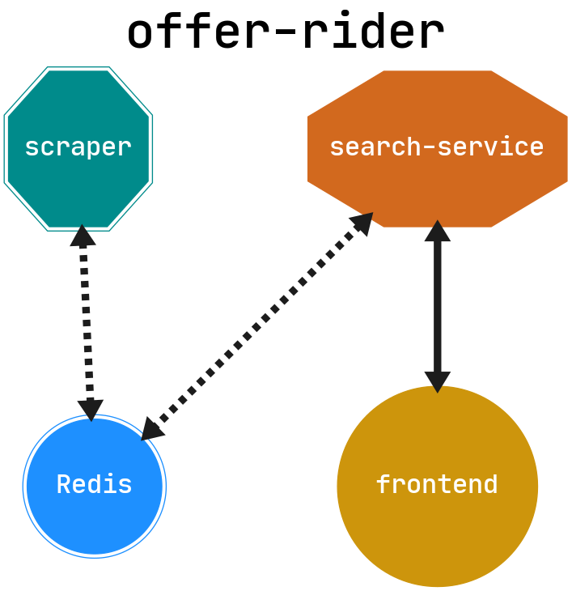

# offer-rider

## about
The system for automatic searching advertisements on e-commerce web sites

## componets
The system composes of three independent modules:
* [scraper](./scraper/readme.md)
* [search-service](./search-service/readme.md)
* [frontend](./frontend/readme.md)

See their readmes for more documentation

## schema

## deployment - Docker

Set `OFFER_RIDER_ARCHITECTURE` variable accordingly to your machine - `arm` or `x86`

Run `docker-compose up --build` in your console, while running docker VM on your machine.
If you want clean Docker after shuting down all containers type `docker-compose down -v --rmi all --remove-orphans`.

## credits
tba
